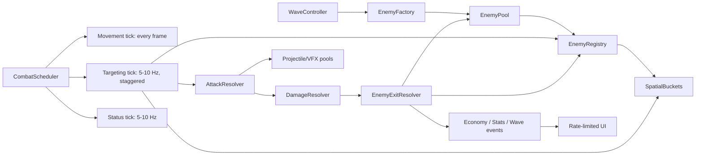
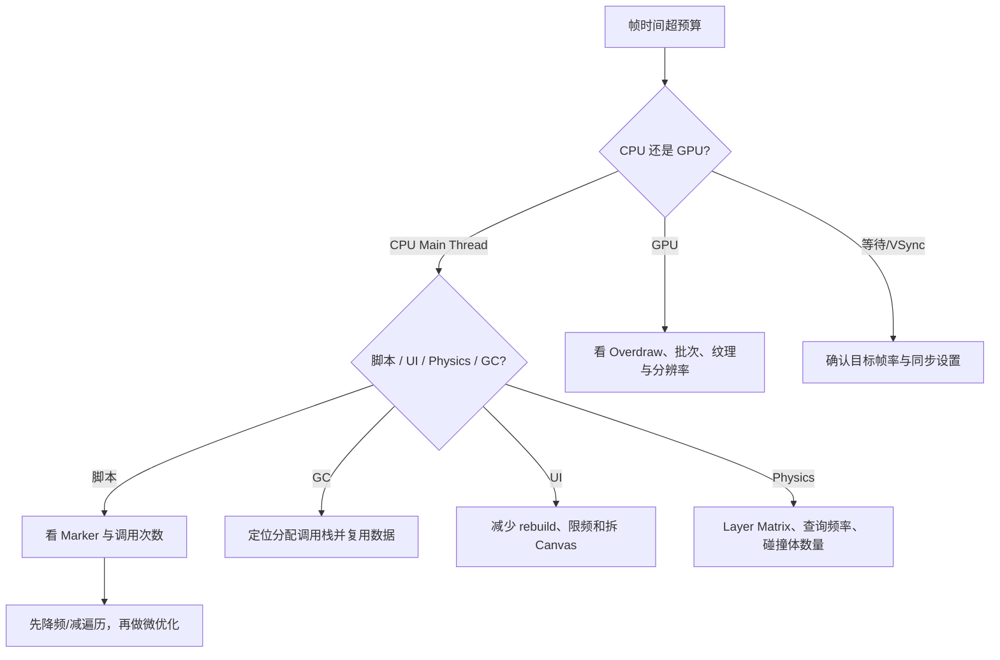

# 《细胞防卫战》大量敌人性能设计与验证

> 文档状态：性能基线 v1.1  
> 适用引擎：Unity 2022.3.53f1c1  
> 目标平台：Windows PC、Android、iOS  
> 配套架构：[TECHNICAL_ARCHITECTURE.md](TECHNICAL_ARCHITECTURE.md)  
> 最近更新：2026-08-30

## 0. 结论先行

本项目采用“可测量的经典 Unity 架构”，不在首个三关版本直接引入 DOTS/ECS。大量敌人的主要性能路线是：

1. 用 `EnemyRegistry` 维护活跃敌人，禁止每座塔反复查找场景对象。
2. 用分频调度和空间桶减少锁敌次数，禁止每座塔每帧扫描所有敌人。
3. 高频攻击采用“立即结算伤害 + 池化视觉曳光”，慢速投射物才保留实体飞行。
4. 敌人、投射物、命中特效和伤害数字均有容量与回收策略；不是无限增长的池。
5. 状态效果集中低频结算，不为每个效果开启独立协程或逐帧更新。
6. UI 通过事件和限频刷新，不逐帧拼接字符串。
7. 所有结论在 Development Build 的目标设备上用 Profiler 验证；Editor 数据只用于定位趋势。

这条路线能覆盖对象池、算法复杂度、数据布局、调度、GC、Profiler、渲染批次、移动端预算和渐进优化等求职知识，同时保持代码规模适合个人学习项目。

---

## 1. 性能不是一句“不卡顿”

### 1.1 三档测试规模

以下都是“设计目标”，只有记录了设备和采样数据后才能改写为作品集成果。

| 档位 | 活跃敌人 | 活跃塔 | 可见投射物/VFX | 用途 |
|---|---:|---:|---:|---|
| 正常战斗 | 120 | 20 | 180 | 三关正式玩法的上限场景 |
| 高压战斗 | 250 | 30 | 300 | Boss 召唤、提前开波重叠与极端组合 |
| 工程压力 | 500 | 40 | 500 | 找复杂度拐点，不作为正式关卡承诺 |

移动端验收以“正常战斗”为主，工程压力档用于 PC 和编辑器外构建定位瓶颈。关卡设计不应为了展示数字而让玩家面对 500 个无法辨认的单位。

### 1.2 帧率与帧预算

| 平台档位 | 正常战斗目标 | 最低可接受 | 说明 |
|---|---:|---:|---|
| 中档 Windows PC | 60 FPS | 1% Low 不低于 50 FPS | 16.67 ms 帧预算，保留系统波动空间 |
| 中档 Android 横屏 | 60 FPS | 可切换稳定 30 FPS | 温度稳定 10 分钟后再判断，不只测冷启动 |
| iOS 目标机 | 60 FPS | 可切换稳定 30 FPS | 至少选一台真实设备验证 |

CPU 主线程不应长期吃满整个 16.67 ms；正常战斗建议把脚本主线程目标控制在 6–8 ms 内，为渲染、动画、系统调用与弱机保留余量。这是项目目标，不是跨设备通用标准。

### 1.3 稳态内存与 GC 目标

- 波次进行中的稳定战斗阶段：脚本 `GC Alloc` 目标为 `0 B/frame`。
- 波次切换、打开结算面板等低频操作允许少量可解释分配，但不得随波次持续增长。
- 对象池使用量达到峰值后，活跃对象数应回落；池的保留上限不能无限扩张。
- 连续运行三关或同一压力场景 15 分钟，托管内存、纹理内存和对象数量不能呈单调无界增长。
- 每一次资源加载必须有对应释放策略。只有实际需要动态加载/远程更新时才引入 Addressables。

### 1.4 每次性能记录必须包含

```text
提交/版本：
Unity 版本：
设备与系统：
构建：Development / IL2CPP 或 Mono / 分辨率 / VSync / 目标帧率
场景规模：敌人、塔、投射物、粒子、UI 数量
采样时间：预热时长 + 正式采样时长
CPU：平均帧、P95、P99、最重 ProfilerMarker
GPU：平均耗时、批次、SetPass、Overdraw 观察
内存：总量、纹理、托管堆、活跃对象和池容量
GC：B/frame、每分钟回收次数、最大尖峰
结论：瓶颈、改动、前后对比、是否回退
```

---

## 2. 当前新工程基线与未来风险

截至 2026-08-30，场景只运行一个 `PathFollower` 敌人，没有塔锁敌、投射物、状态、对象池或 HUD，因此还不存在“大量敌人性能结论”。当前阶段只修正确性和生命周期；完成战斗闭环后才执行 PERF-0。

| 当前事实/未来朴素方案 | 现在的判断 | 规模扩大后的风险 | 触发后的目标方案 |
|---|---|---|---|
| 一个 `PathFollower.Update` 逐帧移动 | 正确且容易理解，继续保留 | 数百敌人时才可能出现回调和路径读取成本 | 先测量；仅在移动成为瓶颈时评估集中调度或紧凑路径数据 |
| `WaveController` 使用 `Instantiate` 创建一个敌人 | 首个闭环允许 | 高频生成销毁可能产生 CPU/GC 尖峰 | 先完成退出契约；Profiler 证明后再建立有上限的敌人池 |
| `Destroy(enemy)` 只销毁组件 | 正确性 Bug，不是性能优化点 | 场景残留 GameObject，测试结果和对象计数失真 | 先改为销毁敌人 GameObject，再谈池化 |
| 尚未实现塔扫描 | 目前没有搜索性能问题 | 若每塔每帧遍历所有敌人，复杂度接近 `塔数 × 敌人数 × 帧数` | 先做小规模清晰实现，再引入 Registry、分频；空间桶必须有 Profiler 证据 |
| 尚未实现目标策略 | 先保证规则正确 | 仅用几何最近会违背“最接近泄露”的设计 | 暴露路径进度，默认按进度锁敌 |
| 当前使用 Inspector/`Initialize` 显式引用 | 符合目标 | 后续若重新加入全局 Find，会产生隐藏依赖和查找成本 | 继续显式连接；规模扩大后由 Composition Root 统一装配 |
| 尚未实现 Projectile/VFX | 没有必要提前建池 | 高频实体子弹可能造成生成、Transform 和碰撞成本 | 高频攻击可立即结算、视觉独立池化；慢速投射物保留实体 |
| 尚未实现状态和 HUD | 没有当前瓶颈 | 每个状态独立协程、UI 每帧拼字符串会造成调度和分配 | 状态低频 Tick；UI 按事件更新并对高频统计限频 |
| 固定塔位尚未实现 | 不创建动态 20×20 网格 | 运行时大网格会增加对象和输入检测 | M3 直接预放少量 `BuildSlot` |

### 2.1 为什么朴素锁敌会成为核心瓶颈

假设 30 座塔、250 个敌人，每座塔每帧扫描一次，60 FPS 时每秒需要检查约：

```text
30 × 250 × 60 = 450,000 次候选检查/秒
```

这还没有包含状态、碰撞、粒子和 UI。单次距离检查并不可怕，真正的问题是所有系统都在重复遍历同一批对象。把锁敌降到 10 Hz 后，候选检查先降到六分之一；再用空间桶只查询射程附近候选，规模会进一步降低。

---

## 3. 运行时性能架构



### 3.1 `EnemyRegistry`

职责：

- 保存当前活跃敌人的紧凑集合。
- 敌人启用时注册，死亡、泄露或清场时只注销一次。
- 提供按路线、空间桶、阵营和可被选中状态过滤的候选查询。
- 暴露只读视图或复用缓冲区，不把可修改的内部 `List` 交给塔。
- 记录 `ActiveCount`，为波次完成判断提供事实来源之一。

非职责：

- 不计算伤害。
- 不发放奖励。
- 不决定塔的目标策略。
- 不直接更新 UI。

删除采用“交换到末尾后移除”还是稳定顺序移除，应通过 Profiler 和目标策略决定。若目标排序依赖注册顺序，就不能为了理论性能偷偷改变语义。

### 3.2 `CombatScheduler`

把不同逻辑按所需频率分层：

| 任务 | 建议频率 | 原因 |
|---|---:|---|
| 敌人视觉移动 | 每帧 | 保持画面平滑 |
| 路线进度计算 | 每帧或移动后 | 锁敌和泄露依赖，计算可与移动合并 |
| 塔转向/炮口插值 | 每帧，仅可见塔 | 只影响表现 |
| 重新锁敌 | 5–10 Hz | 玩家通常无法分辨 100–200 ms 的锁敌刷新 |
| 已有目标合法性检查 | 每次开火前 | 目标可能已死亡、回池或离开射程 |
| DoT/减速等状态 | 5–10 Hz | 用累计时间保持总伤害，不依赖帧率 |
| HUD 数字 | 5–10 Hz 或事件触发 | 避免高频 Canvas rebuild |
| 战斗统计图 | 2–5 Hz | 无需逐事件重画 |

分频不能让所有塔在同一帧集中执行。为塔分配稳定槽位，例如 `towerId % bucketCount`，把 10 Hz 查询均匀散到各帧。

### 3.3 空间桶与路线索引

固定路线塔防优先选择简单、可解释的结构：

1. 地图切成固定大小的二维桶，桶边长约等于常见塔射程的一半至一倍。
2. 敌人跨桶时才更新桶归属，不是每帧从全部桶重建。
3. 塔查询覆盖其射程 AABB 的少量桶，再用平方距离做精确过滤。
4. 同一路线候选按 `PathProgress` 比较，默认选最接近终点者。
5. 多入口时 `NormalizedProgress` 统一到 0–1；若路线实际威胁不同，再加入剩余路程或出口权重。

首关只有单路线且 120 敌人时，可以先使用 `EnemyRegistry` 全表 + 10 Hz 分频。Profiler 证明锁敌仍重后再加入空间桶。这能保留清楚的优化前后证据。

### 3.4 路线移动数据

每条路线加载时预计算：

- 每段起点、终点、方向、长度和累计长度。
- 总路线长度。
- 分支入口与出口 ID。
- 必要时的弧线采样点，而不是运行时反复求复杂曲线。

每个敌人的最小运行时数据：当前段索引、段内距离、累计进度、速度倍率和退出状态。移动时避免逐帧搜索下一个 Waypoint，也避免反复读取层级中的 `Transform[]`。

---

## 4. 攻击、投射物与特效预算

### 4.1 权威结算和视觉表现分离

| 攻击类型 | 权威玩法结算 | 视觉表现 |
|---|---|---|
| 中性粒细胞哨兵速射 | 开火时命中当前有效目标 | 50–100 ms 微脉冲曳光，可合并或抽帧 |
| 溶酶体酸化炮抛射 | 池化慢速投射物到达后爆炸 | 囊泡弹 + 落点预告 + 酸化区 |
| 神经脉冲刺突 | 立即链式结算 | 短时折线电弧，不使用实体子弹 |
| 巨噬细胞清除 | 近距离条件判定 | 伪足包裹动画，不创建碰撞子弹 |
| 抗体 B 细胞中继 | 立即或短延迟标记/单体结算 | 抗体环与信号中继点 |
| 纤维蛋白壁垒 | 周期范围脉冲或被动场 | 低频纤维环，禁止持续高粒子覆盖 |

伤害结算与视觉对象分离后，即使 VFX 池达到上限，也只能降低画面密度，不能丢伤害或改变战斗结果。

### 4.2 对象池策略

每一种池都要定义：

| 字段 | 说明 |
|---|---|
| Prewarm | 根据常规战斗预生成，不以压力峰值全部预热 |
| Soft Limit | 超过后允许临时增长并记录警告 |
| Hard Limit | 达到后执行降级策略，禁止无界增长 |
| Overflow | 跳过次要 VFX、复用最旧视觉，或只保留权威结算 |
| Reset Contract | 回池时清理事件、协程、目标、Trail、Particle、状态和父节点 |
| Ownership | 归本局 `GameplayContext`，退局统一清理 |

敌人池不能在 `OnDisable` 里发击杀奖励；死亡、泄露、强制清场必须由 `EnemyExitResolver` 以互斥原因处理，然后再回池。

### 4.3 粒子与伤害数字

- 同屏命中粒子设全局预算，超出时优先保留 Boss、技能和玩家刚选中目标的效果。
- 小额连续伤害数字按目标和短时间窗合并，例如 0.2 秒内显示一次累计值。
- 伤害数字、状态图标、血条都池化并只在可见/重要时启用。
- 禁止每颗子弹创建新材质实例；使用共享材质、MaterialPropertyBlock 或 SpriteRenderer 颜色。
- 透明粒子面积越大越容易增加移动端 Overdraw；以短寿命、硬边缘、少层叠为优先。

---

## 5. 状态效果的低成本设计

### 5.1 数据结构

每个敌人只维护当前有效状态的紧凑集合。状态实例至少包含：

- `StatusId`
- 来源或来源塔 ID（只有规则需要时保留）
- 强度、层数、结束时间
- 下一次结算时间
- 叠加策略：刷新、叠层、取强、独立来源或互斥

减速最终只输出一个聚合速度倍率；易伤最终只输出一个受击修正；不要让移动代码遍历每个来源重新计算。

### 5.2 时间语义

- 以绝对游戏时间记录结束点，暂停时由统一时钟决定是否推进。
- DoT 用“累计时间 × DPS”或固定 Tick 补偿，避免低帧率时丢伤害。
- 暂停、倍速、教程暂停都经过 `GameClock/TimeController`；其他脚本不直接写 `Time.timeScale`。
- UI 动画若要在暂停菜单继续，使用 unscaled time；战斗规则默认使用 scaled game time。

### 5.3 不采用的方案

- 每次中毒启动一个无限叠加的协程。
- 每个状态创建一个独立 GameObject。
- 在状态 `Update` 中使用 LINQ 查找相同效果。
- 状态过期时直接修改 ScriptableObject 配置。

---

## 6. GC 与 C# 热路径检查表

热路径指战斗中每帧或高频执行的方法。进入热路径前先用 Profiler 证明频率。

- 复用候选 `List<T>`、数组和查询结果缓冲区。
- 禁止热路径 LINQ、装箱、字符串插值、闭包捕获和临时集合。
- 缓存组件和依赖；不在 Update 中 `GetComponent`、`Find` 或 `FindObjectOfType`。
- 距离排序只比较平方距离；只需要最佳目标时不要对全部候选排序。
- 事件订阅必须在对象回池/禁用时解除，避免对象被委托长期引用。
- 使用 `struct` 前先确认复制成本、装箱和 Unity 序列化规则；不是所有数据改成结构体都会更快。
- 避免在运行时反复访问 `Renderer.material` 生成材质副本。
- 日志在压力测试中可通过条件或等级关闭；不要让每次命中打印 Console。
- 协程适合少量流程编排，不适合为数百敌人各自维护多个高频状态。

Unity 官方建议减少临时分配、复用集合并优先使用对象池，可参阅 [Unity 2022.3 垃圾回收最佳实践](https://docs.unity3d.com/ja/2022.3/Manual/performance-garbage-collection-best-practices.html) 和 [`ObjectPool<T>` API](https://docs.unity3d.com/2022.3/Documentation/ScriptReference/Pool.ObjectPool_1.html)。

---

## 7. 2D 渲染与资源预算

### 7.1 渲染层约定

```text
Background
Path
BuildSlots
GroundVFX
Enemies
Towers
Projectiles
AirVFX
WorldUI
ScreenUI
```

- 塔、敌人与投射物按类别进入 Sprite Atlas，减少纹理切换；同类尽量共享材质。
- 同一角色动画帧使用一致尺寸、Pivot 和 Pixels Per Unit，避免运行时抖动。
- 地图背景避免拆成大量透明重叠 Sprite；静态装饰可合批或烘焙。
- Sorting Layer 用于大类，Order in Layer 只处理局部顺序；不要为每个对象创建独立层。
- 重要状态用轮廓、图标和色形共同表达，不能只依赖颜色。
- 分辨率变化通过 Canvas Scaler、Safe Area 和相机视口处理，不复制 PC/手机两套玩法 UI。

Unity 的 2D Sprite 工作流和 Sprite Atlas 入口可参阅 [Unity 2022.3 Sprites 手册](https://docs.unity3d.com/cn/2022.3/Manual/Sprites.html)。

### 7.2 Addressables 的边界

三关固定内容可以先使用 Inspector 直接引用。出现以下需求之一再引入 Addressables：

- 关卡或皮肤需要按需加载/卸载。
- 内容显著增多，启动时不应全部驻留。
- 需要远程内容或独立更新包。
- 需要用标签组织跨关资源并记录引用生命周期。

Addressables 不是自动省内存：加载会增加引用计数，释放必须与加载匹配，AssetBundle 的拆分粒度也会影响内存。参阅 [Addressables 1.21 内存管理](https://docs.unity3d.com/kr/Packages/com.unity.addressables%401.21/manual/MemoryManagement.html) 和 [Unity 运行时资源管理概览](https://docs.unity3d.com/ja/current/Manual/assets-managing-introduction.html)。

---

## 8. Profiler 工作流

### 8.1 测量顺序

1. 建立可复现的 PerformanceTest 场景或开发面板。
2. 预热池和 Shader，等待 30–60 秒温度/缓存稳定。
3. 在 Development Build 中连接目标设备。
4. 先看 CPU Timeline：确认主线程、渲染线程或等待谁是瓶颈。
5. 再看 GC Alloc、内存、Rendering、Physics 2D 和 UI。
6. 用自定义 `ProfilerMarker` 包围锁敌、移动、状态、伤害和波次完成判断。
7. 只改变一个主要变量，记录优化前后相同场景数据。
8. 若无改善或牺牲可维护性，回退该优化并记录结论。

Unity 官方明确建议在目标平台/设备上分析，Editor 会加入额外开销并只能提供近似趋势，参阅 [Unity 6 目标设备性能分析](https://docs.unity3d.com/cn/6000.0/Manual/profiling-target-device.html) 和 [Unity 2022.3 Profiling applications](https://docs.unity3d.com/2022.2/Documentation/Manual/profiler-profiling-applications.html)。

### 8.2 建议的自定义 Marker

```text
CellDefense.Enemy.Move
CellDefense.Enemy.SpatialRelocate
CellDefense.Targeting.Query
CellDefense.Targeting.Validate
CellDefense.Combat.ResolveAttack
CellDefense.Combat.ResolveDamage
CellDefense.Status.Tick
CellDefense.Wave.EvaluateCompletion
CellDefense.UI.RefreshHUD
CellDefense.Pool.Get
CellDefense.Pool.Release
```

### 8.3 诊断决策树



---

## 9. 压力测试场景设计

### 9.1 可复现参数

性能场景不能依赖手速，必须允许通过 Inspector 或开发面板设置：

- 随机种子。
- 路线数量与长度。
- 敌人类型、数量、每秒生成量、生命和速度。
- 塔种类、数量、射速、射程、状态概率。
- 投射物与 VFX 是否显示。
- UI、伤害数字、血条是否显示。
- 目标帧率、分辨率和画质档位。

通过逐项关闭表现层，可以判断瓶颈属于规则、GameObject/Transform、UI 还是 GPU。

### 9.2 必测用例

| ID | 场景 | 主要验证 |
|---|---|---|
| P-01 | 120 普通敌人 + 20 哨兵塔 | 锁敌、速射与曳光 |
| P-02 | 250 敌人多入口汇合 + 30 混合塔 | 空间桶、路线进度和状态叠加 |
| P-03 | 500 无 VFX 敌人 | 移动和 Transform 上限 |
| P-04 | 120 敌人 + 最大酸池/电弧/VFX | Overdraw、粒子和池上限 |
| P-05 | 连续 15 分钟循环波次 | 内存、事件泄漏、池回收 |
| P-06 | 暂停/倍速反复切换 100 次 | 时钟语义、协程和状态到期 |
| P-07 | 敌人在被攻击同帧死亡/泄露/清场 | 退出原因互斥、双奖励和对象复用 |
| P-08 | Android 真机热态 10 分钟 | 温控、帧率与输入响应 |

### 9.3 完成判定

大量敌人优化只有同时满足以下条件才算完成：

- 达到 1.1 的正常战斗规模和目标平台帧率。
- 稳态战斗无持续 GC 分配，且无每波递增的对象/内存。
- 锁敌结果符合玩法优先级，优化没有改变战斗语义。
- 池达到上限时只降级视觉，不丢伤害、不阻塞波次。
- 死亡、泄露与清场互斥，统计和奖励各执行一次。
- 有至少一组“优化前/优化后”相同场景截图或 Profiler 数据。
- 开发者能解释瓶颈、所选方案、复杂度变化、代价以及为何暂未使用 DOTS。

---

## 10. 渐进实施顺序与学习归属

| 阶段 | 内容 | 责任 | 进入条件 |
|---|---|---|---|
| PERF-0 | 建压力场景、Marker 和基线表 | 【你主导】 | 战斗循环可运行 |
| PERF-1 | 缓存依赖、去掉热路径 Find、修复明显分配 | 【你主导】 | 有调用栈证据 |
| PERF-2 | `EnemyRegistry`、路径进度锁敌 | 【你主导】 | 能解释注册生命周期 |
| PERF-3 | 锁敌分频与错峰 | 【协作完成】 | PERF-2 数据稳定 |
| PERF-4 | 投射物/VFX/伤害数字池与上限 | 【协作完成】 | 能区分权威结算与表现 |
| PERF-5 | 集中状态 Tick 和 UI 限频 | 【你主导】 | 至少两种状态已实现 |
| PERF-6 | 空间桶 | 【你主导】 | Profiler 证明全表锁敌仍是瓶颈 |
| PERF-7 | Sprite Atlas、Overdraw、真机画质档 | 【协作完成】 | 正式美术进入项目 |
| PERF-8 | Jobs/Burst 实验分支 | 【后续学习】 | 500 敌人移动经验证仍为 CPU 瓶颈 |
| PERF-9 | DOTS/ECS 独立实验 | 【后续学习】 | 有明确对比问题，不阻塞正式三关 |

AI 可以代办压力数据录入模板、重复测试场景配置和结果制表；开发者必须亲自完成 Profiler 定位、核心优化选择、前后对比和面试讲解。

---

## 11. 反过度优化规则

- 没有基线，不做性能重构。
- 没有明确瓶颈，不引入复杂数据结构。
- 只快 1% 但让调试难度翻倍的优化默认不保留。
- 不用“对象池、Jobs、Burst、DOTS”名词数量评价架构质量。
- 不把正式玩法变成纯压力测试；可读性和决策密度优先于同屏数字。
- 不用 PC Editor 的一次峰值代表移动端结论。
- 性能债务允许分阶段存在，但必须有测试场景、阈值和复审时间。

---

## 12. 变更日志

| 日期 | 版本 | 变更 |
|---|---|---|
| 2026-08-10 | 1.0 | 建立大量敌人预算、运行时框架、池化边界、Profiler 流程、压力测试与渐进优化路线 |
| 2026-08-30 | 1.1 | 删除旧工程性能现状，记录单敌人新工程基线；明确先修正确性、战斗闭环后再执行 PERF-0 |
