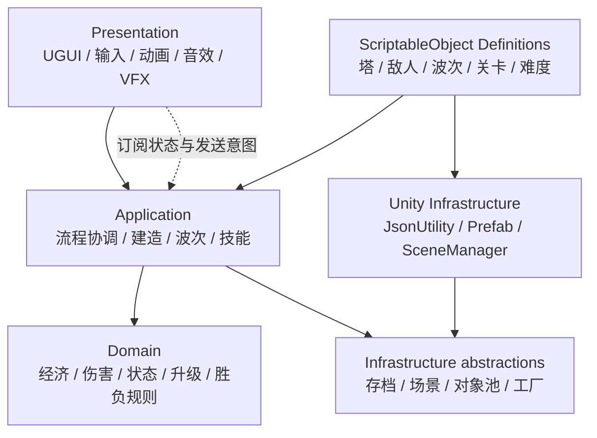
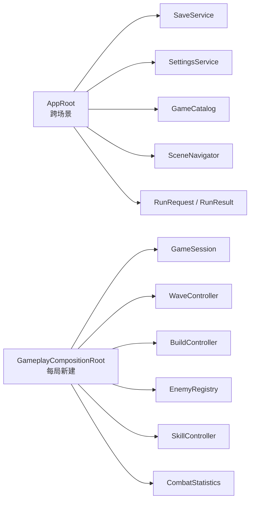
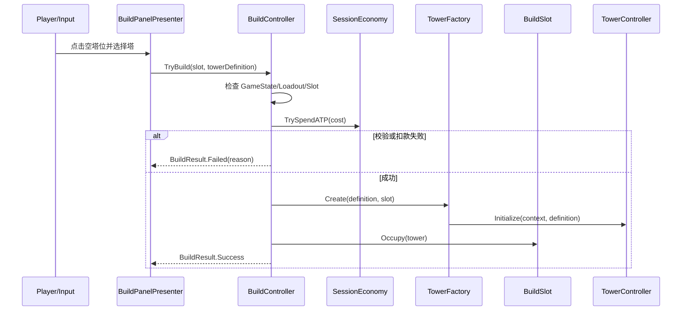
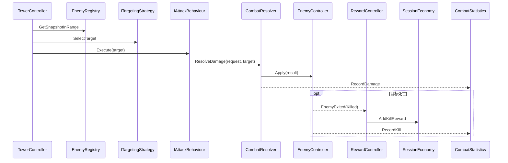
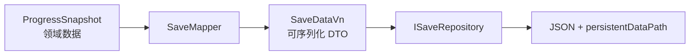
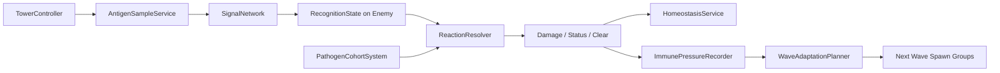

# 《细胞防卫战：伤口入侵》技术架构与代码学习路线

> 文档状态：目标架构 v0.3  
> 适用引擎：Unity 2022.3.53f1c1  
> 文档导航：[README.md](README.md)  
> 配套策划：[GAME_DESIGN_FRAMEWORK.md](GAME_DESIGN_FRAMEWORK.md)  
> 性能专项：[PERFORMANCE_MANY_ENEMIES.md](PERFORMANCE_MANY_ENEMIES.md)  
> 最近更新：2026-08-30

---

## 0. 这套架构由谁设计

当前阶段采用“AI 提供架构脚手架，开发者通过实现和迭代学会设计”的方式：

- AI 负责提出初始模块边界、依赖方向、类职责、迁移顺序和备选方案。
- 开发者不需要从空白开始设计整个项目，但需要逐项确认自己是否理解。
- 核心模块的第一版实现尽量由开发者完成；AI 以问题、伪代码、接口提示和代码审查为主。
- 当实际代码证明初始设计不合适时，双方根据证据修改本文，不把初稿当成不可变规则。
- 经过建造、战斗、波次和存档四轮实践后，开发者应开始独立提出局部架构方案，再由 AI 评审。

目标不是让开发者“背下一套架构”，而是逐步掌握：如何识别职责、如何控制依赖、如何决定是否抽象、如何安全重构。

---

## 1. 架构目标与非目标

### 1.1 目标

1. 支撑三关、六塔、四类基础敌人、三资源和多阶段 Boss。
2. 保持每个阶段可运行，允许从当前原型渐进迁移。
3. 让核心规则可以脱离具体场景进行推理和少量测试。
4. 减少全局单例、运行时查找、重复代码和隐含初始化顺序。
5. 数据、美术表现和运行时状态分离。
6. 让代码职责可以在面试中用简洁数据流说明。
7. 为 PC 和手机输入、存档、本地化及性能优化保留清晰扩展点。

### 1.2 非目标

- 不追求企业级 DDD、完整 Clean Architecture 或复杂依赖注入框架。
- 不为尚未出现的十几种塔预先构建万能技能编辑器。
- 不使用全局 EventBus 替换所有直接调用。
- 不在前三关核心开发阶段引入 ECS/DOTS、联网或热更新框架。
- 不为了使用设计模式而增加没有实际职责的类。

判断抽象是否值得的简单规则：至少已经有两个真实实现，或一个明确且近期的第二实现；否则先写清楚的具体代码。

---

## 2. 总体依赖方向



核心规则：

- UI 可以读取应用层暴露的状态并发送“玩家意图”，不能直接扣 ATP、改生命或生成塔。
- ScriptableObject 保存静态定义，不能保存一局中的当前生命、冷却或塔等级。
- Unity 基础设施实现存档、Prefab 生成和场景切换；核心规则不直接依赖文件路径或具体 Canvas。
- 上层可以依赖下层的公开契约，下层不能反向查找并控制上层。

---

## 3. 场景与生命周期架构

当前阶段例外：新工程只使用 `Prototype.unity` 验证单局纵向切片，不提前建立菜单、存档和跨场景常驻对象。只有一塔战斗闭环稳定后，才按下述目标拆分 `Bootstrap`、`MainMenu` 和 `Gameplay`。Prototype 未加入 Build Settings 前，只算 Editor 验证场景。

### 3.1 场景列表

| 场景 | 责任 | 是否常驻 |
|---|---|---|
| `Bootstrap` | 创建应用级服务、加载存档、进入主菜单 | `AppRoot` 常驻 |
| `MainMenu` | 主菜单、选关、塔组/技能配置、图鉴、设置 | 否 |
| `Gameplay` | 创建单局服务、载入关卡 Prefab、运行战斗与结算 | 否 |

三张关卡地图不各复制一套系统场景。`Gameplay` 根据 `LevelDefinition` 实例化不同的 `LevelRoot` Prefab，从而共享同一套流程、UI 和服务。

### 3.2 应用级与单局级对象



- `AppRoot` 是唯一允许使用受控单例入口的对象，负责跨场景服务；它不处理战斗规则。
- `GameplayCompositionRoot` 每次进入关卡时创建并连接单局对象，退出关卡时全部释放。
- 其他 Manager 不再各自创建静态 `Instance`。
- 暂不引入第三方依赖注入容器；通过构造函数、`Initialize` 方法和 Inspector 引用显式连接依赖。

### 3.3 Unity 生命周期约定

| 回调 | 项目约定 |
|---|---|
| `Awake` | 只缓存自身组件、建立不依赖外部顺序的内部状态 |
| `OnEnable` | 订阅事件、恢复可响应状态 |
| `Start` | 不依靠 Script Execution Order 猜测其他管理器是否完成初始化 |
| `Update` | 只处理确实需要逐帧运行的逻辑 |
| `OnDisable` | 取消在 `OnEnable` 中建立的订阅、取消延迟调用 |
| `OnDestroy` | 释放最终资源；不能假设其他对象仍存在 |
| `OnValidate` | 编辑器内检查 ID、数值范围、列表长度和引用完整性 |

跨系统初始化由 `GameplayCompositionRoot` 明确按顺序执行：创建服务 -> 载入关卡 -> 建立工厂和池 -> 初始化 UI -> 进入 Preparation 状态。

---

## 4. 推荐目录与命名空间

当前工程统一把自有内容放在 `Assets/_Project/`，避免与 Unity 默认资源、Package 示例和未来第三方资产混在一起。目录按当前真实结构渐进扩展：

```text
Assets/
└── _Project/
    ├── Art/
    │   ├── Animations/
    │   ├── Sprites/
    │   └── VFX/
    ├── Audio/
    ├── Data/
    │   ├── Towers/
    │   ├── Enemies/
    │   ├── Waves/
    │   └── Levels/
    ├── Prefabs/
    │   ├── Towers/
    │   ├── Enemies/
    │   └── Projectiles/
    ├── Scenes/
    │   └── Prototype.unity
    ├── Scripts/
    │   ├── Core/
    │   ├── Paths/
    │   ├── Enemies/
    │   ├── Combat/
    │   ├── Building/
    │   ├── Towers/
    │   ├── Waves/
    │   ├── Economy/
    │   ├── UI/
    │   └── Data/
    ├── Tests/
    │   ├── EditMode/
    │   └── PlayMode/
    └── UI/
```

当前教学骨架暂时不使用命名空间，避免在第一个移动闭环中同时引入额外概念。纵向切片稳定、脚本数量继续增长或开始建立 asmdef 时，再一次性加入以下命名空间，不允许长期出现一半全局、一半命名空间的混合状态：

```text
CellDefense.Core
CellDefense.Data
CellDefense.Building
CellDefense.Combat
CellDefense.Enemies
CellDefense.Economy
CellDefense.Paths
CellDefense.Towers
CellDefense.Waves
CellDefense.UI
CellDefense.Infrastructure
```

程序集定义分阶段加入：

1. 原型稳定前不急于拆分 asmdef。
2. 第一关纵向切片稳定后建立 `CellDefense.Runtime`。
3. Editor 工具使用 `CellDefense.Editor`，只引用 Runtime。
4. 测试使用 `CellDefense.Tests.EditMode` 和 `CellDefense.Tests.PlayMode`。

---

## 5. 数据定义与运行时状态

### 5.1 数据资产总览

| 资产 | 保存内容 | 不保存内容 |
|---|---|---|
| `TowerDefinition` | ID、名称、图标、Prefab、建造费、等级数据、分支描述 | 当前等级、冷却、累计投入 |
| `EnemyDefinition` | ID、Prefab、最大生命、速度、护甲、奖励、泄露伤害、标签 | 当前生命、当前节点、状态 |
| `WaveSequenceDefinition` | 每波倒计时、Spawn Group、Boss 标记 | 当前波、已生成数、存活数 |
| `LevelDefinition` | 地图 Prefab、初始资源、生命、波次、允许内容、镜头规则 | 当前游戏状态和统计 |
| `SkillDefinition` | ID、消耗、冷却、图标、目标方式、表现引用 | 当前冷却和使用次数 |
| `DifficultyDefinition` | 资源、敌人属性、提示和复苏规则的倍率/开关 | 玩家当前选择 |

所有正式资产都由 Unity 菜单创建。每个定义具有稳定且唯一的字符串 `definitionId`，用于存档和统计；资源文件名可以变化，但 ID 一旦进入正式存档就不能随意修改。

### 5.2 塔等级结构

不再使用三组互相依赖的平行 List。建议数据形状为：

```text
TowerDefinition
├── buildCost
├── level1: TowerLevelStats
├── level2: TowerLevelStats + upgradeCost
├── branchA: TowerBranchDefinition + TowerLevelStats + upgradeCost
└── branchB: TowerBranchDefinition + TowerLevelStats + upgradeCost
```

`TowerLevelStats` 至少包含射程、伤害和攻击间隔。塔的独特机制先由对应 Prefab 上的具体行为组件实现；完成至少三座机制不同的塔后，再根据真实重复代码抽取共享能力接口，避免提前设计万能配置表。

### 5.3 波次结构

```text
WaveSequenceDefinition
└── waves[]
    ├── countdown
    ├── earlyStartCoefficient
    └── spawnGroups[]
        ├── enemyDefinition
        ├── entryPathId
        ├── count
        ├── startDelay
        ├── interval
        └── pattern
```

一个 Wave 包含多个 Spawn Group，因此可以表达混合交替、多个入口、坦克带杂兵和 Boss 伴随单位。运行时追踪数据与资产分离。

### 5.4 运行时模型

建议使用普通 C# 对象保存规则状态：

- `GameSession`：当前关卡、难度、流程状态、生命和单局服务入口。
- `SessionEconomy`：ATP、生物酶及收支事件。
- `TowerRuntimeState`：等级、分支、累计投入、冷却和禁用状态。
- `EnemyRuntimeState`：当前生命、路径进度、护甲/抗性和状态集合。
- `WaveRuntimeState`：当前波、生成是否完成、场上相关敌人数。
- `RunStatistics`：单局统计。

MonoBehaviour 负责把运行时模型连接到 Transform、Collider、Animator 和 UI，不把所有规则都直接写在生命周期函数里。

---

## 6. 核心类与职责

### 6.1 应用级

| 类 | 类型 | 单一职责 |
|---|---|---|
| `AppRoot` | MonoBehaviour | 创建跨场景服务并保证唯一性 |
| `GameCatalog` | ScriptableObject | 汇总可用关卡、塔、技能和难度定义 |
| `SceneNavigator` | 普通类/组件 | 封装场景切换与加载进度 |
| `SaveService` | 普通类 | 读写、校验、迁移单一存档 |
| `SettingsService` | 普通类 | 音效、语言、震动、字号等设置 |
| `RunRequest` | 普通数据 | 从选关页传递关卡、难度、四塔和两技能 |

### 6.2 游戏流程

| 类 | 类型 | 单一职责 |
|---|---|---|
| `GameplayCompositionRoot` | MonoBehaviour | 组装本局依赖并控制初始化/销毁顺序 |
| `GameSession` | 普通类 | 聚合本局核心状态，不直接操作 UI |
| `GameStateMachine` | 普通类 | 校验状态转换、保存当前状态并发出变化事件 |
| `LifeService` | 普通类 | 扣除生命、触发归零事件，禁止重复结算 |
| `GameFlowController` | MonoBehaviour | 协调准备、波间、战斗、暂停和胜负 |
| `GameTimeController` | 普通类/组件 | 集中管理暂停与后续倍速，保存恢复前速度 |

第一版状态机使用枚举、转换规则和事件即可。等第三关 Boss 的状态行为明显复杂后，再学习“每个状态一个类”的状态模式；不要一开始就制造十几个空状态类。

### 6.3 建造系统

| 类 | 类型 | 单一职责 |
|---|---|---|
| `BuildSlot` | MonoBehaviour | 保存塔位类型、占用者和可交互表现 |
| `BuildController` | 普通类 | 校验状态、塔组、塔位、费用并执行建造/出售 |
| `TowerFactory` | 普通类 | 从 Definition/Prefab 创建并初始化 TowerController |
| `TowerLoadout` | 普通只读数据 | 保存本局允许的四塔 |
| `BuildPanelPresenter` | MonoBehaviour | 显示可建塔并把点击转成建造请求 |
| `TowerPanelPresenter` | MonoBehaviour | 显示升级分支、属性和出售操作 |

`BuildSlot` 不负责扣钱，`BuildPanelPresenter` 不负责生成 Prefab，`TowerController` 不负责决定自己能否被购买。

### 6.4 防御塔系统

| 类/接口 | 类型 | 单一职责 |
|---|---|---|
| `TowerController` | MonoBehaviour | 塔的 Unity 入口、冷却更新和行为协调 |
| `TowerRuntimeState` | 普通类 | 等级、分支、累计投入和是否瘫痪 |
| `ITargetingStrategy` | 接口 | 从敌人快照中选择一个目标 |
| `ProgressTargeting` | 普通类 | 选择最接近终点的目标 |
| `FastestTargeting` | 普通类 | 选择高速/护盾优先目标 |
| `IAttackBehaviour` | 接口 | 执行一次具体攻击意图 |
| `ProjectileAttack` | 组件 | 从池中取得射弹并初始化 |
| 具体塔能力组件 | 组件 | 慢速光环、酸池、连锁、吞噬、标记等独特逻辑 |

接口形状只规定必要行为，不暴露实现细节：

```csharp
public interface ITargetingStrategy
{
    EnemyController SelectTarget(
        IReadOnlyList<EnemyController> candidates,
        in TargetingContext context);
}
```

上面是设计契约，不要求现在复制粘贴。`【你主导】` 根据实际需要决定空列表、死亡目标、范围和优先级如何处理。

多路线长度不同时，默认策略优先比较“沿当前路线到终点的实际剩余距离”，不能只比较 Waypoint 下标或每条路线各自的归一化进度。若多个终点具有不同战略权重，再由 `TargetingContext` 提供额外权重。

### 6.5 敌人系统

| 类 | 类型 | 单一职责 |
|---|---|---|
| `EnemyController` | MonoBehaviour | 初始化敌人组件、协调死亡/泄露生命周期 |
| `Health` | 普通类或轻组件 | 当前生命、接收结算结果、只触发一次死亡 |
| `PathFollower` | MonoBehaviour | 沿路径移动并暴露进度/剩余距离 |
| `StatusController` | 组件 | 应用、更新、移除和查询状态 |
| `EnemyRegistry` | 普通类 | 保存有效敌人快照并提供查询，不决定锁敌策略 |
| `EnemyAbility` | 抽象组件 | 分裂、护盾、治疗、冲刺等可选能力 |

死亡和泄露是两个互斥结束原因。`EnemyController` 统一生成 `EnemyExitReason`，波次、奖励、统计分别读取这一结果，避免在多个 `OnDestroy` 中猜测发生了什么。

### 6.6 战斗系统

| 类/数据 | 责任 |
|---|---|
| `DamageRequest` | 来源、基础值、伤害类型、标签 |
| `DamageCalculator` | 按固定顺序计算护甲、抗性和易伤 |
| `DamageResult` | 最终伤害、是否击杀、被哪些规则修改 |
| `StatusEffectSpec` | 类型、强度、持续时间、来源和叠加规则 |
| `CombatResolver` | 协调一次伤害/状态应用并报告统计 |

`DamageCalculator` 应尽量是无 Unity 依赖的纯 C#，是第一批适合开发者亲自写测试的模块。

### 6.7 波次系统

| 类 | 类型 | 单一职责 |
|---|---|---|
| `WaveController` | MonoBehaviour | 倒计时、提前开波、调度 Spawn Group |
| `WaveRuntimeState` | 普通类 | 当前波、生成状态、存活计数、完成状态 |
| `EnemyFactory` | 普通类 | 取得/创建敌人并完成初始化 |
| `SpawnPointRegistry` | 场景组件 | 按稳定 ID 提供入口与路径 |

胜利检查只有一个入口：每当“生成完成状态”或“相关敌人数”变化时调用 `EvaluateCompletion()`。这样可消除最后一个敌人先死亡、生成协程后结束时漏判胜利的问题。

### 6.8 技能、统计和 UI

| 类 | 单一职责 |
|---|---|
| `SkillController` | 校验携带、状态、生物酶和冷却，执行技能 |
| `CombatStatistics` | 只收集战斗事件并生成只读结算快照 |
| `HudPresenter` | 订阅资源、生命、波次并更新 UGUI |
| `ResultPresenter` | 将结算快照展示为结算页 |
| `TutorialController` | 推进短步骤教学，不写入核心规则 |
| `WorldInputController` | 把鼠标/触控转换为选择意图，后续可接 Input System |

UI 不在 `Update()` 中每帧重新拼接所有文本。数据变化时由持有数据的服务发送事件，Presenter 订阅并局部刷新。

---

## 7. 关键数据流

### 7.1 建塔流程



关键不变量：所有校验集中在 `BuildController`；扣款成功后若创建异常，需要回滚 ATP 并保持塔位为空。

### 7.2 攻击与击杀流程



敌人不直接依赖经济服务。由 `RewardController` 订阅统一敌人退出结果并发奖；重要的是奖励只从 `Killed` 结果产生一次，`Leaked`、切场景清理和对象池回收不能产生奖励。

### 7.3 波次与胜利流程

```text
进入 WaveCountdown
-> 玩家提前开波或倒计时归零
-> WaveController 调度全部 Spawn Group
-> 每个敌人注册到 EnemyRegistry/WaveRuntimeState
-> 敌人死亡或泄露时注销
-> 生成完成或存活数变化时 EvaluateCompletion
-> 当前波清空：Intermission 或下一波倒计时
-> 最后一波清空：请求 Victory
-> GameStateMachine 保证只转换一次
```

### 7.4 暂停与时间

- 只有 `GameTimeController` 可以修改 `Time.timeScale`。
- 暂停前保存当前倍率，恢复时还原，而不是固定写回 1。
- 暂停菜单、UI 动画和必要提示使用非缩放时间。
- 战斗冷却、敌人移动和波次刷怪使用缩放时间。
- 后续加入 2 倍速时，不修改各系统内部数值，只修改统一时间倍率。

---

## 8. 直接调用、事件和接口如何选择

### 8.1 使用直接调用

需要立即得到结果或明确存在调用方/被调用方时使用：

- `BuildController.TryBuild(...) -> BuildResult`
- `SessionEconomy.TrySpendATP(...) -> bool`
- `DamageCalculator.Calculate(...) -> DamageResult`
- `GameStateMachine.TryChange(...) -> bool`

### 8.2 使用事件

一个事实发生后，零个或多个观察者可以响应时使用：

- `ATPChanged`
- `LivesChanged`
- `GameStateChanged`
- `WaveStarted/WaveCompleted`
- `EnemyExited`
- `TowerBuilt/Upgraded/Sold`

事件只描述已经发生的事实，不用事件询问“是否可以买塔”。事件命名采用过去式或 Changed，订阅者必须在对应生命周期解绑。

### 8.3 使用接口

存在多个真实策略，且调用者不应知道具体实现时使用：

- `ITargetingStrategy`
- `IAttackBehaviour`
- `ISaveRepository`
- `IPoolable`

不为只有一个简单实现的工具类提前增加 `IWhateverManager`。

### 8.4 不使用全局 EventBus

全局 EventBus 会隐藏事件来源、订阅者和生命周期，不利于当前学习阶段 Debug。事件由真正拥有状态的对象公开，通过 Composition Root 把需要的对象连接起来。

---

## 9. Prefab 与场景对象规范

### 9.1 LevelRoot Prefab

```text
LevelRoot
├── Environment
├── Paths
│   ├── Path_A
│   └── Path_B
├── SpawnPoints
├── Goal
├── BuildSlots
├── CameraBounds
└── LevelEvents
```

LevelRoot 只包含地图内容和关卡 Authoring，不包含 GameManager、HUD 或存档服务。

### 9.2 Tower Prefab

```text
TowerRoot
├── TowerController
├── Collider/Selection
├── Visual
├── FirePoint(s)
├── RangePreview
└── Ability component(s)
```

所有塔都通过 `TowerController.Initialize` 进入有效状态。未经初始化时不攻击，并在开发构建中给出清晰错误。

### 9.3 Enemy Prefab

```text
EnemyRoot
├── EnemyController
├── PathFollower
├── StatusController
├── Collider2D/Rigidbody2D
├── Visual/Animator
├── HealthBarAnchor
└── Optional EnemyAbility
```

敌人 Definition 不重复挂在多个组件上；由 `EnemyController` 接收一次并传递所需初始值。

### 9.4 Inspector 与序列化规则

- 字段默认使用 `[SerializeField] private`，只通过只读属性暴露读取。
- 必填引用使用 `OnValidate` 或自定义校验工具检查。
- 不依靠数组下标长期表示内容 ID；使用稳定 ID 或明确引用。
- 不在 Unity 外手写 `.asset`、Prefab 或 Scene YAML。
- 重命名序列化字段时使用 `FormerlySerializedAs` 并验证旧资源迁移。

---

## 10. 对象池设计

第一阶段只对高频、生命周期短的对象池化：子弹和命中特效。Profiler 证明敌人创建造成明显尖峰后再池化敌人。

建议契约：

```csharp
public interface IPoolable
{
    void OnRent();
    void OnReturn();
}
```

泛型池学习目标：

- `ComponentPool<T> where T : Component, IPoolable`。
- 池拥有 Prefab 和容器，不通过全局 `ObjectPool.Instance` 访问。
- 重复归还、归还错误池、对象销毁和场景卸载均有保护。
- 射弹归还时清空目标、取消 Invoke/协程、复位速度与视觉状态。

不要一开始写能够管理所有资源、跨场景、自动扩容、异步加载的万能池。

---

## 11. 存档架构



建议类：

- `SaveData`：包含 `version`、关卡星级、记忆点、解锁、图鉴和设置。
- `SaveService`：负责默认数据、加载、验证、迁移、保存和重置。
- `JsonSaveRepository`：只负责文件读写。
- `SaveMigrator`：版本增加后把旧 DTO 转为当前结构。

写入策略：先写临时文件并验证，再替换正式文件；保留上一份备份。损坏时提示并加载安全默认值，不能直接让游戏无法启动。

首版使用 `JsonUtility` 可支持的简单列表结构，不为了字典序列化立即增加第三方库。

---

## 12. 调试与可观察性

### 12.1 日志规范

- 日志包含系统和对象上下文，例如 `[Wave] Wave 3 spawn completed`。
- 可预期的购买失败不打印 Error，由 UI 展示 `BuildFailureReason`。
- 违反不变量、缺失必填引用和重复结算打印 Error。
- 高频 Update、移动和每发子弹默认不打印日志。
- 发布构建可关闭详细诊断日志。

### 12.2 可调试结果类型

核心命令不要只返回 `false`，而应返回能解释原因的结果：

```text
BuildResult
├── success
├── failureReason
├── spentATP
└── createdTower
```

这样 UI、测试和 Debug 都能知道失败是余额不足、状态不允许、塔位占用还是塔不在 Loadout。

### 12.3 调试面板

第二阶段可增加仅开发构建显示的 Debug Panel：

- 添加 ATP/生物酶。
- 跳到指定波次。
- 调整游戏速度。
- 生成指定敌人。
- 显示同屏数量、对象池统计和当前状态。

该面板是学习和调数值工具，正式比赛包默认关闭。

---

## 13. 当前代码到目标职责的推进

新工程没有旧类需要迁移。下面的“当前状态”只说明哪些职责已经可运行，不能把空骨架当作已完成功能。

| 当前类/资产 | 当前状态 | 下一次扩展边界 |
|---|---|---|
| `WaypointPath` | 已运行；保存有序路径点并验证索引 | 增加编辑器引用完整性检查，不承担移动 |
| `PathFollower` | 已运行；逐帧移动、推进节点、停止与单次到达通知 | M4 后暴露路径进度；暂停由 GameFlow 统一控制 |
| `EnemyController` | 已接入 Health，并统一处理 Killed/Leaked/Cleared | M4 把退出原因接入奖励、基地生命和波次计数 |
| `Health` | 已实现初始化、校验、生命变化和单次死亡 | 后续补自动化边界测试，不承担奖励或销毁 |
| `WaveController` | 单敌人验证器；接收明确退出原因并销毁 GameObject | M4 扩展短波次与完成判定 |
| `BuildSlot`、`BuildController` | 已通过三个固定塔位的一塔免费建造测试 | M4 接入 ATP，并保持验证、支付、创建、初始化、占用的事务顺序 |
| `TowerController`、`Projectile` | TowerController 已保存 Definition；Projectile 仍为骨架 | M4 实现最小锁敌和攻击，不预建六塔万能基类 |
| `EconomyService`、`GameFlowController`、`HudController` | 教学骨架 | M4 形成 ATP、状态、胜负和事件驱动显示闭环 |
| 三个 Definition | 空 ScriptableObject 骨架 | M5 在纵向切片稳定后定义第一批静态数据 |
| `Prototype.unity` | Editor 验证场景 | 完成可构建闭环时加入 Build Settings |

---

## 14. 从零构筑的里程碑顺序

每一步结束后都必须保留一个可重复的 Play Mode 验证。核心实现由开发者完成；AI 提供需求、边界、Review 和机械配置协助。

### M0：新工程和目录基线（已完成）

- 使用 Unity 2022.3.53f1c1 创建 2D Core 项目。
- 建立 `Assets/_Project/` 目录和必要 API 骨架。

完成标准：项目可编译，目录和类职责能被说明。

### M1：固定路线移动（已完成）

- 场景配置 6 个有序路径点。
- `WaypointPath` 提供只读数量和安全索引。
- `PathFollower` 完成帧率无关移动、节点推进和单次终点事件。
- 一个敌人能从 P00 移动至 P05，并由波次验证器接收结果。

学习重点：序列化引用、数组、属性、Update、`Time.deltaTime`、事件和状态不变量。

### M2：生命与敌人退出（已完成）

1. 先把 `Destroy(enemy)` 修正为销毁敌人 GameObject。
2. 实现 `Health` 的初始化、伤害、生命变化和单次死亡。
3. 定义死亡、泄露、清场等明确退出原因。
4. 让 `EnemyController` 统一解决退出，并保证同帧只结算一次。
5. 让 `WaveController` 根据退出原因接收结果。

完成标准：死亡和泄露不会同时奖励、扣命或减少两次存活计数。

### M3：固定塔位与一座塔建造（已完成）

1. 实现场景预置 `BuildSlot` 的空闲、占用和释放。
2. `BuildController` 作为唯一建造入口，按验证 -> 扣款 -> 生成 -> 初始化 -> 占用执行。
3. 只支持一座哨兵塔，不实现升级、出售分支和六塔通用工厂。

学习重点：职责、所有权、事务顺序、失败不改变状态和显式依赖。

### M4：首个战斗纵向切片

1. 实现最小锁敌和攻击。
2. 接入 ATP、敌人奖励和泄露生命。
3. 把单敌人验证器扩展为 2–3 个短波次。
4. 接入 Running、Paused、Victory、Defeat 和最小 HUD。
5. 建立从开局到结算的 PC 鼠标操作闭环。

完成标准：占位资源下可完整打一局，关键结算只发生一次。

### M5：数据化与第二座塔

1. 定义第一版 `EnemyDefinition`、`TowerDefinition` 和 `WaveDefinition`。
2. 静态配置与本局状态分离，数据资产从 Unity 菜单创建。
3. 加入第二座机制不同的塔，完成最小“识别 -> 效应”免疫反应链。
4. 出现真实变化点后再提取 Strategy 或 Factory 边界。

学习重点：ScriptableObject、序列化、Definition/State、组合和设计模式触发条件。

### M6：第一关内容

- 逐步扩展六塔基础形态、四类敌人、5 波和 Boss。
- 接入升级、出售、提前开波、教学、基础 VFX 和完整结算。
- 至少三座塔完成独特行为后复盘共享攻击能力。

### M7：性能与交付基线

- 建立 Windows Development Build、压力场景和 Profiler 基线。
- 只按证据加入 EnemyRegistry、分频、对象池和空间桶。
- 建立高价值 EditMode/PlayMode 测试与可复现 Bug 记录。

### M8：第二/三关与发布系统

按实际里程碑逐步加入多入口路径图、状态系统、信号网络、存档、UI 自适应、移动输入、本地化、Boss 状态机和平台构建。

---

## 15. 开发者与 AI 的实现流程

### 15.1 核心学习任务的默认流程

1. AI 解释任务目标、输入输出、约束和验收条件。
2. 开发者先画小数据流或写伪代码。
3. 开发者完成第一版核心实现。
4. 开发者先自行运行并记录报错或异常现象。
5. AI 做代码 review，优先提问题和证据，不立即整段重写。
6. 开发者修复并解释根因。
7. AI 补充重复边界、文档和机械代码。

### 15.2 提示升级阶梯

遇到困难时按顺序增加帮助：

1. 提问定位知识点。
2. 给出 Unity API 名称或文档方向。
3. 给出伪代码和数据流。
4. 给出局部示例，不覆盖整个模块。
5. 开发者已经尝试并仍被阻塞时，AI 提供完整参考实现，再由开发者逐段解释和修改。

### 15.3 责任表

| 模块 | 架构设计 | 第一版核心代码 | Review/边界补充 | 重复工作 |
|---|---|---|---|---|
| GameState | AI 提案 + 共同确认 | 你 | AI | AI 可代办测试数据 |
| Economy/Life | AI 提案 + 你补规则 | 你 | AI | AI 可代办样板 |
| Build | AI 提案 + 共同确认 | 你 | AI | AI 可代办 UI 绑定 |
| Targeting/Damage | 共同设计 | 你 | AI | AI 可补参数测试 |
| Wave | AI 提案 | 你 | AI | AI 可录入波次数据 |
| Status/Boss | 第一版共同设计，后续由你提案 | 你 | AI | AI 可扩展重复状态 |
| UI 自适应 | AI 给规范 | 你完成第一套 | AI | AI 可复制后续面板 |
| Save | AI 给数据与迁移框架 | 你写主路径 | AI | AI 可补 DTO/异常用例 |
| Git/文档/构建脚本 | AI | 你理解并批准 | 共同 | AI 可代办 |

---

## 16. 架构学习检查点

每完成一个模块，开发者应能回答：

1. 这个类唯一拥有的数据是什么？
2. 谁创建它，何时销毁它？
3. 它依赖谁，为什么依赖方向合理？
4. 哪些调用需要立即结果，哪些适合事件？
5. 如果对象被禁用、场景切换或目标中途死亡会怎样？
6. 哪条规则适合普通 C#，哪部分必须是 MonoBehaviour？
7. 当前抽象解决了哪个真实重复或变化点？
8. 如果删除这个类，职责会落到哪里？

当开发者能独立回答并能在代码中验证时，对应知识掌握等级才提升。

---

## 17. 应避免的过度设计与常见陷阱

- 每个系统都做单例，最后通过静态入口互相调用。
- 建立全局万能 EventBus，导致事件来源和订阅生命周期不可追踪。
- UI 直接修改 GameManager 字段。
- ScriptableObject 同时充当配置和本局状态。
- 为六种独特塔预先做一个包含几十个布尔值的万能 TowerData。
- 在只有一个实现时给所有类加接口、抽象基类和工厂。
- 把所有塔特殊逻辑继续堆进 BaseTower 的巨大 switch。
- 在 Awake 中查找并假设其他对象已经完成 Awake。
- 用 `OnDestroy` 猜测敌人是死亡、泄露还是切场景清理。
- 为了学习 A* 强行替换固定路线，使玩法和架构复杂度无收益增长。
- 未使用 Profiler 就对所有对象池化或进行微优化。
- 一次重写全部系统，长时间失去可运行版本。

---

## 18. 架构决策记录（ADR）

| ID | 决策 | 原因 | 代价/复审条件 |
|---|---|---|---|
| ADR-001 | 一个 Gameplay 场景加载不同 LevelRoot Prefab | 避免三关复制系统和 UI | 地图出现特殊烘焙/场景需求时复审 |
| ADR-002 | 只有 AppRoot 可作为受控跨场景单例 | 保留简单入口，同时限制全局状态 | 若依赖仍隐藏，改为更明确的上下文传递 |
| ADR-003 | 不使用第三方 DI 容器 | 当前规模不需要，先学显式依赖 | 模块和测试数量显著增长后复审 |
| ADR-004 | 静态 Definition 与运行时 State 分离 | 防止共享资产被局内修改，便于存档与测试 | 长期保持 |
| ADR-005 | 不使用全局 EventBus | 提高可追踪性和生命周期清晰度 | 只有出现大量真正跨域广播时复审 |
| ADR-006 | 先实现三塔再抽取通用攻击能力 | 根据真实重复设计抽象 | 第三塔完成后必须复盘 |
| ADR-007 | 标准难度无 ATP 被动恢复 | 让击杀与提前开波形成可控经济 | 试玩证明等待或软锁严重时复审 |
| ADR-008 | 固定塔位同时构成预制 `SignalGraph` | 让位置决定免疫信息传递，并避免运行时自由连线复杂度 | 信号网络降低可读性或限制有效阵型时复审 |
| ADR-009 | 群落行为按 `Cohort + SpatialBucket` 低频聚合 | 支持病原群落玩法，避免敌人两两逐帧扫描 | Profiler 证明低频聚合仍超预算时复审 |
| ADR-010 | 炎症由事件累积、统一服务结算 | 防止每座塔直接修改全局值，便于回放与平衡 | 长期保持 |
| ADR-011 | 适应在波间快照生成且对玩家公开 | 避免隐藏动态难度和同帧行为改变 | 试玩证明信息负担过高时简化 |
| ADR-012 | 玩法结算与投射物/VFX 分离 | 视觉池达到上限时不能丢失伤害或改变结果 | 慢速可躲避投射物仍保留到达时结算 |
| ADR-013 | 自有资源统一放入 `Assets/_Project`；命名空间延后到纵向切片稳定后一次性加入 | 与默认/第三方资源隔离，同时降低首个闭环的学习噪声 | 脚本继续增长或建立 asmdef 前必须复审 |

新增或推翻重要架构决定时，在此记录问题、备选方案、选择和代价，而不是只改代码不留原因。

---

## 19. 架构阶段验收

目标架构不以“文件都创建了”为完成，而以以下结果验收：

- 能从选关创建带关卡、难度、四塔和两技能的 RunRequest。
- Gameplay 初始化顺序明确，不依赖 `FindObjectOfType` 或随机 Awake 顺序。
- 建造操作只有一个权威入口，失败原因可解释，出售能释放塔位。
- 敌人死亡与泄露互斥，奖励、统计和波次计数各执行一次。
- 默认锁敌使用路径进度，塔可以替换真实策略。
- 波次能表达混合、多入口和 Boss 伴随组，胜利不受回调顺序影响。
- UI 通过事件刷新，不直接写经济和生命字段。
- 暂停和倍速只有一个时间控制入口。
- 存档有版本、默认值、损坏恢复和安全写入方案。
- 开发者能画出建造、攻击和胜利三条数据流，并解释至少一次架构调整。

---

## 20. 特色玩法模块框架

特色玩法以四个小而明确的模块组成，不把逻辑继续堆进 `BaseTower`、`EnemyHealth` 或 `GameManager`。



### 20.1 `SignalNetwork`

静态配置 `SignalGraphDefinition` 随 `LevelDefinition` 加载：

- 节点 ID、位置和对应 `BuildSlotId`。
- 可见连接边、方向（若有）和传递延迟。
- 枢纽、感染、阀门等节点标签。
- 编辑器校验：重复 ID、孤立节点、无效边、没有入口识别链。

运行时 `SignalNetworkState` 只保存：

- 每个节点当前塔的反应角色。
- 有效/感染/关闭状态。
- 当前少量抗原样本 Token 及过期时间。
- 信号阀门状态。

样本传递是离散事件或固定低频 Tick，不每帧沿 LineRenderer 做几何查询。连接线只读取状态进行表现，不能反向驱动规则。

推荐接口边界：

```text
ISignalNetwork.PublishSample(nodeId, sample)
ISignalNetwork.GetReachableRecipients(nodeId, sampleType, reusableBuffer)
ISignalNetwork.SetNodeCondition(nodeId, condition)
ISignalNetwork.NodeChanged += ...
```

`GetReachableRecipients` 的第一版可以对 4–12 个节点做 BFS；节点数极小，不需要复杂寻路。开发者应亲自实现并能解释队列、访问集合和为何不用 A*。

### 20.2 `RecognitionState` 与 `ReactionResolver`

每个敌人只暴露三阶段识别状态：未识别、已采样、已标记。底层数据包含样本类型、到期时间和标记来源，但 UI 不展示内部全部字段。

`ReactionResolver` 输入为一个不可变上下文：

```text
ReactionContext
- sourceTowerId / sourceRole
- targetEnemyId / cohortId
- recognitionStage
- attackTags
- targetTags
- currentHomeostasisBand
```

输出为明确结果列表：伤害、状态、群落中断、炎症变化、样本/标记变化和视觉提示 ID。它不直接播放粒子，不修改 ScriptableObject，不查找场景对象。

反应配置不应变成任意字符串脚本系统。六塔与三关规模先使用枚举 Tag + 少量显式规则；出现至少十个真实反应且策划频繁组合后，才评估数据化反应表。

### 20.3 `PathogenCohortSystem`

`PathogenCohort` 是敌群的运行时聚合，不是 MonoBehaviour：

- `cohortId`、病原类型、入口与波次 Spawn Group。
- 活跃成员 ID 集合或计数。
- 当前群落感应值、行为状态和冷却。
- 当前软适应。

群落感应每 0.2–0.25 秒更新一次。第一版根据同一 cohort 的活跃数、路线区间和隔离效果计算，不需要逐个敌人求邻居；加入空间桶后才使用桶内密度修正。

成员死亡/泄露/回池必须先从 cohort 注销。Cohort 清空后发布一次结束事件，再由波次系统回收状态。

### 20.4 `HomeostasisService`

统一持有局内炎症值和区间，提供：

```text
AddInflammation(amount, reason, sourceId)
ReduceInflammation(amount, reason, sourceId)
BeginIntermission(duration, isEarlyStart)
CurrentValue / CurrentBand
ValueChanged / BandChanged
```

塔和技能只能报告事件，不直接设置总值。服务负责：

- Clamp 到 0–100。
- 区间转换只发布一次事件。
- 波间恢复和提前开波保留规则。
- 风暴状态的生命损失请求；真正扣除仍由 `LifeService` 执行。
- 战斗统计记录来源，便于试玩判断哪类行为导致失控。

炎症倍率通过只读 `CombatModifiers` 快照提供给攻击系统，避免每颗子弹到处访问单例。

### 20.5 `ImmunePressureRecorder` 与 `WaveAdaptationPlanner`

Recorder 在一波内累计有效伤害、控制时间、群落中断和吞噬次数。波结束时生成不可变快照，Planner 根据阈值选出最多一个下一波适应。

- Planner 不读取玩家输入或实时改变场上敌人。
- 相同输入和随机种子必须得到相同结果，方便重现 Bug。
- 预览 UI 读取规划结果并显示“原因 + 变化 + 应对建议”。
- 教学关使用固定脚本结果；第二关才开启动态规划。
- 适应属于 Spawn Group/群落配置，不修改共享 `EnemyDefinition`。

### 20.6 性能连接点

特色玩法的性能细节以 [PERFORMANCE_MANY_ENEMIES.md](PERFORMANCE_MANY_ENEMIES.md) 为准。架构层只锁定以下约束：

- SignalGraph 节点数量小、事件驱动。
- 群落按组聚合、低频 Tick，不做 O(N²) 邻居扫描。
- 识别状态是敌人现有状态的一部分，不创建额外 GameObject。
- 反应结算与视觉分离，VFX 可降级。
- UI 只订阅区间、样本和预览变化，不逐帧查询所有敌人。

---

## 21. 2026-08-30 当前代码与资产复核

| 当前事实 | 判断 | 下一步 | 学习责任 |
|---|---|---|---|
| `WaypointPath + PathFollower` 已通过单敌人移动测试 | M1 完成 | M4 后补路径进度与暂停语义 | 【你主导】 |
| `Health + EnemyController` 已通过死亡与泄露测试 | M2 完成 | M4 将退出原因连接奖励、基地生命和波次计数 | 【你主导】 |
| `WaveController` 只有一个活动敌人，并在 Start 自动启动 | 合理的临时验证器 | M4 再扩展短波次、生成结束与存活清空判定 | 【你主导】 |
| `BuildSlot + BuildController + TowerDefinition` 已通过三个塔位建造测试 | M3 完成 | M4 接入 ATP 和失败不改变状态的建造事务 | 【你主导】 |
| `TowerDefinition` 当前只保存 Prefab，其余 Definition 仍为骨架 | 足够支持 M3，不是正式数据模型 | M4 增加最小费用/攻击数据，M5 再扩展第二塔 | 【你主导】 |
| 当前没有全局查找、旧双建塔路径或旧数据资产 | 符合新工程方向 | 不重新引入旧工程代码 | 【共同约束】 |
| `Prototype.unity` 未进入 Build Settings | 当前只能证明 Editor Play Mode | 首个闭环完成时加入并生成 Windows Development Build | 【协作完成】 |
| 没有性能采样和压力测试 | 不允许声称已经优化 | 战斗循环稳定后执行 PERF-0 | 【你主导】 |

---

## 22. 变更日志

| 日期 | 版本 | 变更 |
|---|---|---|
| 2026-07-31 | 0.1 | 建立目标架构、类职责、数据流、迁移路线和 AI 学习协作方式 |
| 2026-08-10 | 0.2 | 增加信号网络、群落、炎症、软适应模块；补充当前塔数据序列化与资产迁移复核；连接大量敌人性能专项 |
| 2026-08-30 | 0.3 | 以新工程事实重写目录、当前类状态和 M0–M8 路线；旧工程迁移表退役；记录 Prototype 与已知销毁问题 |
